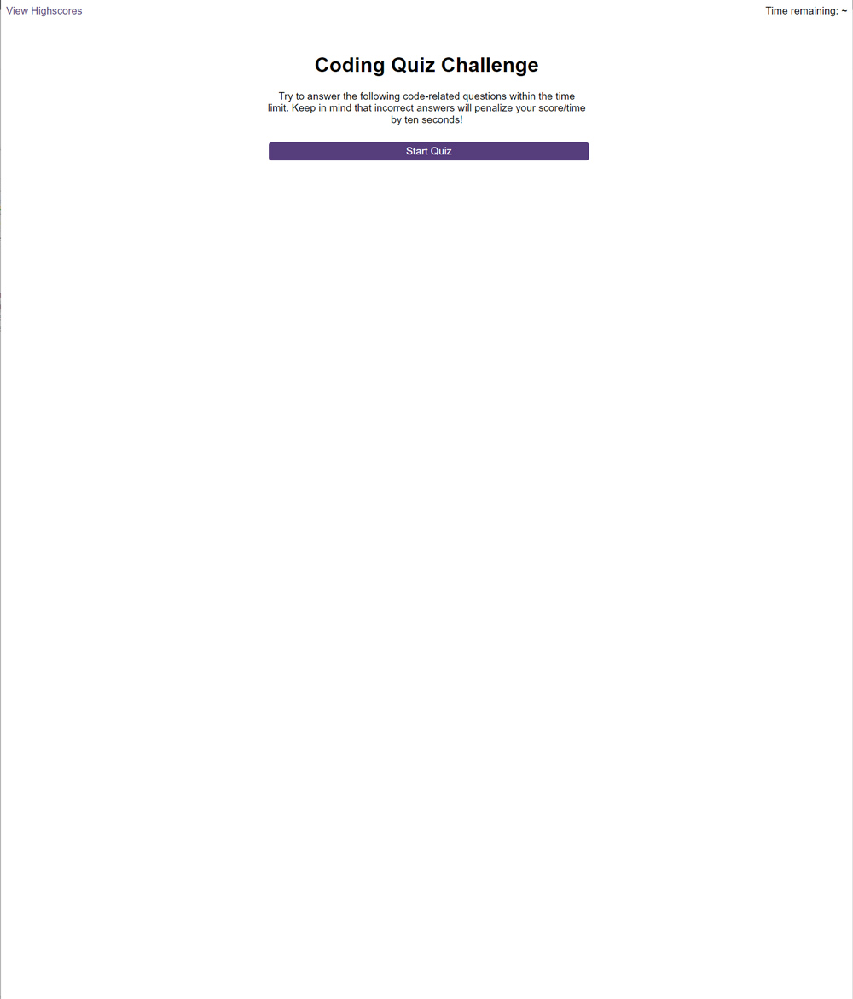

# Code-Quiz

## Description

Mobule 6 challenge - Web APIs: Code Quiz. Create a timed coding quiz with multiple-choice questions. This app will run in the browser, and will feature dynamically updated HTML and CSS powered by JavaScript code.

## User Story

Using code learnt on the Bootcamp, researched, and in discussion with my breakout room group, write the JavaScript code to display a quiz from a series of questions, and store the players score using your browsers **localStorage**.

### Acceptance Criteria

```
GIVEN I am taking a code quiz
WHEN I click the start button
THEN a timer starts and I am presented with a question
WHEN I answer a question
THEN I am presented with another question
WHEN I answer a question incorrectly
THEN time is subtracted from the clock
WHEN all questions are answered or the timer reaches 0
THEN the game is over
WHEN the game is over
THEN I can save my initials and score
```

### Deployed Application

View the deployed application for week-6: Code Quiz at [makemassair.github.io](https://makemassair.github.io/Code-Quiz).

### Screenshot

